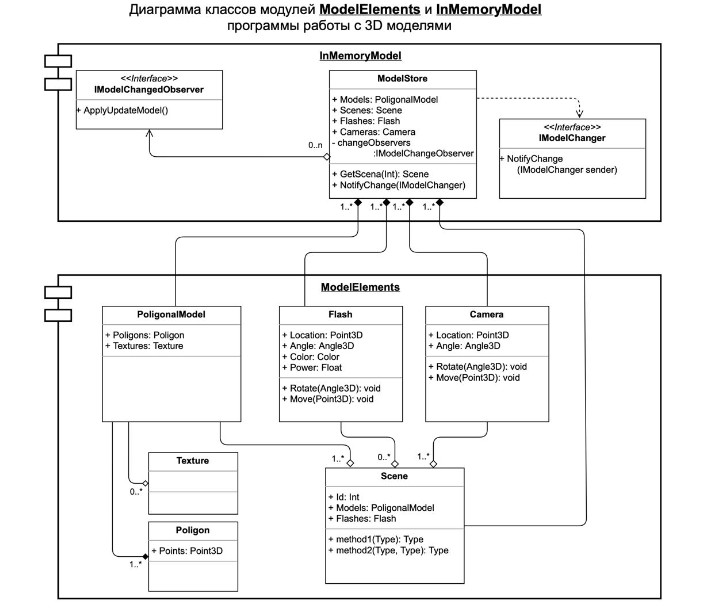

1. Задание: 
    На основе Диаграмы классов написать код,без реализации метод(конструкторы нужно написать ).UML можно найти в презентации.Сдавать работы ТОЛЬКО через Github.
    Диаграмы классов ModelElements, разработать классы: Model Store, PoligonalModel (Texture, Poligon), Flash, Camera, Scene.

